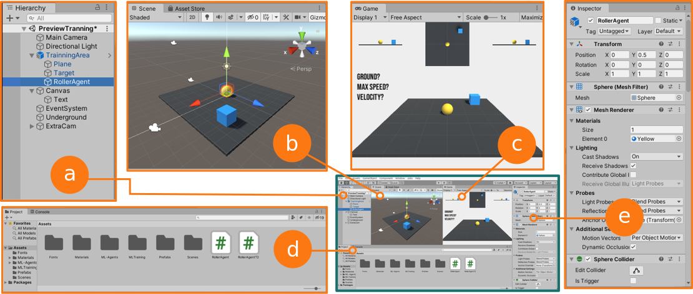

# Minicurso - Aprendizagem Profunda em Unity com ML-Agents

**Sumário**

## Unity

Para instalar o Unity entre no [site](https://store.unity.com/download?ref=personal "site"). Esse trabalho utilizou a versão 2019.4.2f1 que está disponivel no UnityHub.

## ML-Agents

Para instalar o ML-Agents faça:

`
$ git clone --branch release_3 https://github.com/Unity-Technologies/ml-agents.git
`

Para mais informações visite o [site](https://github.com/Unity-Technologies/ml-agents/blob/release_3_docs/docs/Readme.md "site").

Nos ambientes de aprendizado a seguir, é utilizado o algoritmo de *Proximal Policy Optimization (PPO)* para treinar o agente.

## Ambientes de Aprendizado

Estão disponibilizados dois ambientes nesse projeto.

### Ambiente A

É um ambiente simples que contem 3 objetos:

- Plane (*Floor*), um plano representando um solo limitado.
- Sphere (*RollerAgent*), uma esfera de raio unitário que representa o agente.
- Cube (*Target*), um cubo de raio unitário que representa o objetivo do agente.

O agente (*RollerAgent*) tem como objetivo chegar rolando no cubo alvo (*Target*), sem cair do solo. São levados em consideração a velocidade do agente e a sua posição bem como a posição do alvo.

Para realizar o treinamento faça dentro da pasta principal:

`
$ mlagents-learn config/roller_agent.yaml --run-id=AgentA
`
onde o arquivo de configuração do algoritmo PPO (`config/roller_agent.yaml`) deve ser informado, e  a opção `--run-id` determina um nome dado ao treinamento que será executado.

### Ambiente B

O Ambiente B representa uma alteração de forma a deixar o problema mais complexo. Os mesmo três objetos estão presentes, porém agora o alvo pode estar em um ponto do espaço, fazendo com que o agente tenha que pular para pegá-lo. De forma semelhante, o comando deve ser executado:

`
$ mlagents-learn config/roller_agent.yaml --run-id=AgentB
`

## Tutoriais

[Tutorial 1 - instalação da Unity com ML-Agents](https://www.youtube.com/watch?v=gU9UIHbMdDk "Tutorial 1")
[Tutorial 2 - Execução de exemplos presentes no ML-Agents](https://www.youtube.com/watch?v=PVl3hcvJxYY "Tutorial 2")
[Tutorial 3 - Treinando um exemplo do ML-Agents](https://www.youtube.com/watch?v=voojZvrgC5k "Tutorial 3")
